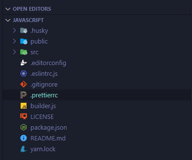
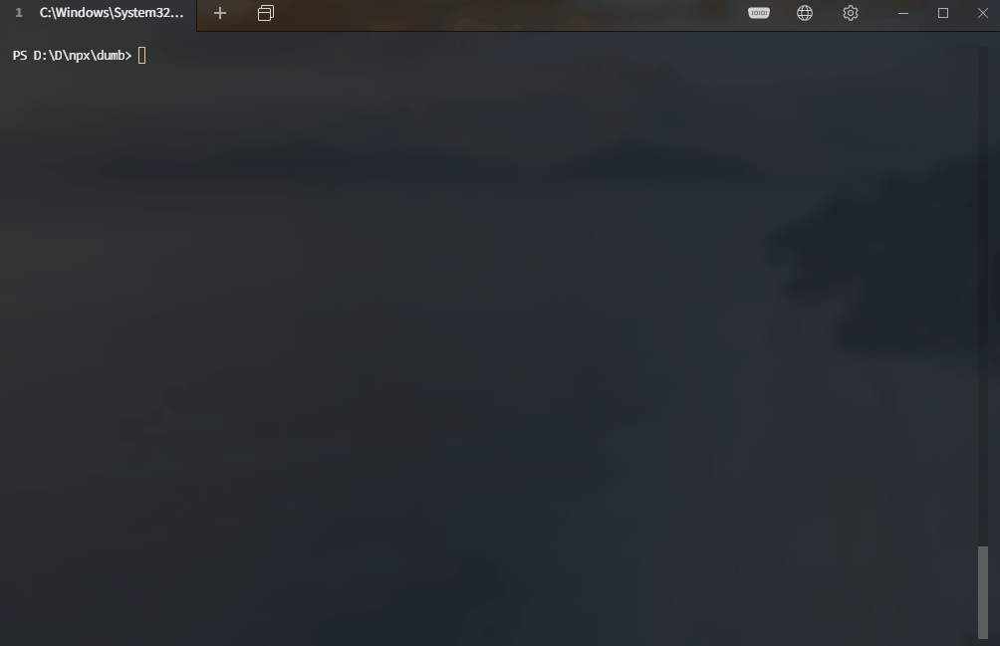

# esbuild Create React App [](https://www.npmjs.com/package/esbuild-create-react-app)  


A minimal replacement for create-react-app using a truly blazing fast [esbuild](https://esbuild.github.io/) bundler. Up and running in less than 1 minute with almost zero configuration needed.
<br />

---

## What is inside?



Truly minimal React app with almost zero configuration needed.

- [TypeScript](https://www.typescriptlang.org/)
- [esbuild](https://esbuild.github.io/)
- [Eslint](https://eslint.org/) with [airbnb](https://github.com/airbnb/javascript) Style Guide
- [Prettier](https://prettier.io/)
- [Husky](https://github.com/typicode/husky)
- [lint-staged](https://github.com/okonet/lint-staged)
- [live-server](https://github.com/tapio/live-server)

## Overview

<p align='center'>

</p>

## Install

```bash
npx esbuild-create-react-app my-app

cd my-app

yarn start | npm run start
```

## Available Templates

- Default [JS template](https://github.com/awran5/esbuild-create-react-app/tree/main/templates/javascript)
- [Typescript template](https://github.com/awran5/esbuild-create-react-app/tree/main/templates/typescript)

### License

MIT © [awran5](https://github.com/awran5/)
